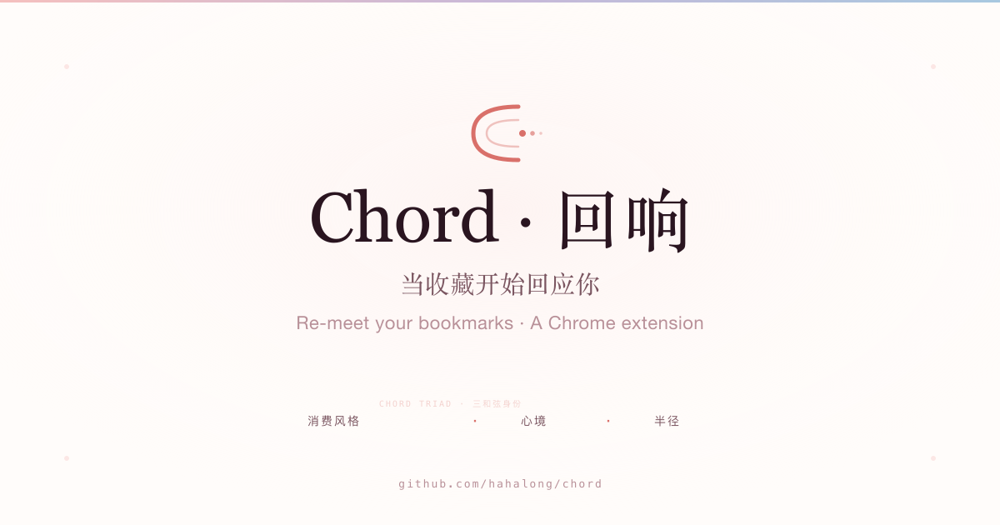

<div align="center">



# Chord · 回响

**当收藏开始回应你**

*念念不忘，必有回响*

[](LICENSE)
[](https://chromewebstore.google.com/detail/bkigfhnjkipajlcklpdnabneegidifcl)
[](#开发)

</div>

---

## 这是什么

Chord 是一个 Chrome 浏览器扩展，把"数字囤积"变成"和自己的对话"。

打开你的书签栏数一数 —— 真正回去读过、用过的有几条？大部分人的答案让自己心虚。

Chord 每天唤醒一条你曾经保存的内容，让你做一个简单决定：**📌 留下来** · **🌸 放手**。3 个月后，它会画出你的「Chord Triad 三和弦身份」—— 27 种组合之一，告诉你跟内容的真实关系。

> **Chord 不是书签管理器。是内容与自我的对话工具。**

---

## 核心体验

### 1. 每日回响 · Popup
打开扩展 → 一条收藏静静浮出 → 三向决策（留下 / 用过 / 放手 · v2 已简化成二向）→ 樱花动效送别。

### 2. 候响室 · 书房总览
脉冲呼吸 + 「都还在，不急」副标 + 按主题分组的待响列表。等待时长用颜色区分。

### 3. 兴趣地形 · 气泡可视化
泡泡越大你越"感兴趣"。**虚线** = 幻觉兴趣（保存多但不用）/ **实线** = 真实热情（保存少但常用）。

### 4. 隐性自我 · 三和弦身份
6 段对话式 Profile：
- **§1 你是谁** —— 三和弦身份（消费风格 × 心境 × 半径，27 种组合）
- **§2 但有件事让我意外** —— 数字反差洞察
- **§3 你的地形** —— 焦虑沼泽 / 真实热情之林 / 新冒火苗 / 沉睡之地
- **§4 你正在变成另一个人** —— 90 天行为轨迹
- **§5 心理引导** —— CBT 4 槽框架（命名 / 代价 / 实验 / 重构）
- **§6 AI 反直觉发现** —— 千人千面

---

## Chord Triad · 三和弦身份系统

每个用户被 3 个维度同时描述：

| 维度 | 选项 | 含义 |
|---|---|---|
| **消费风格** | HOARDER / EXECUTOR / THINKER / SLOW_READER / CURATOR / MINIMALIST / BALANCED | 你怎么对待保存的内容 |
| **心境** | EXPLORER / DEEPENER / SEEKER / RETURNER / SETTLER / DORMANT | 你最近的状态 |
| **半径** | SPECIALIST / GENERALIST / SWITCHER | 你的注意力有多广 |

组合成 27 个有意义的画像，比如：
- **HDG · 多线深挖型囤积家** — "你在好几条路上同时往深里走"
- **CLP · 深耕策展人** — "你精选了——读过、感受过、放下了"
- **EKP · 目标驱动型专家** — "你不是在攒，是在用"
- **MLP · 静默深耕者** — "你不囤——存下的不多，但每条都在用"

---

## 安装

### 方式一 · Chrome 应用商店（推荐）

直接打开应用商店页面安装：

👉 **[Chrome Web Store · Chord 回响](https://chromewebstore.google.com/detail/bkigfhnjkipajlcklpdnabneegidifcl)**

或在 [Chrome 应用商店](https://chromewebstore.google.com/) 搜「Chord 回响」。

### 方式二 · 下载 release 包导入（不上应用商店）

适合无法访问 Chrome 应用商店、想用最新开发版、或想看源码的同学。

👉 **[直接下载最新版 chord.zip](https://github.com/hahalong/chord/releases/latest/download/chord.zip)**（一直指向最新版）

或去 [Releases 页面](https://github.com/hahalong/chord/releases) 选历史版本。

1. 下载 `chord.zip`
2. 解压到任意目录（如 `~/chord-extension/`）
3. Chrome 打开 `chrome://extensions`
4. 右上角打开「**开发者模式**」开关
5. 点左上角「**加载已解压的扩展程序**」→ 选刚才解压的目录
6. Chord 图标出现在工具栏即装好

> 注意：开发者模式装的扩展每次 Chrome 启动会有"使用了开发者模式扩展"提示，关闭即可，不影响使用。
> 如果想消除这个提示，建议用方式一。

### 方式三 · 从源码自己 build

```bash
git clone https://github.com/hahalong/chord.git
cd chord
pnpm install
pnpm build
```

然后按方式二的步骤 3-6，选 `apps/extension/dist` 目录加载。

---

## 隐私

> Chord 设计的第一原则就是隐私。

- **只存本地**模式：所有数据存浏览器 `chrome.storage.local`，**零网络请求**（可用 DevTools 验证）
- **云端同步**模式（可选）：多设备同步，但永远不上报笔记内容，只上报字符数
- **AI 调用透明**：使用你自己的 API Key 或开发者预置的智谱 GLM-4-Flash（免费）
- **数据导出 + 一键删除**：随时拿走你的数据
- **私人注释永远不上报**：你写给自己的话，只在你的设备上

---

## 技术栈

- **前端**：Preact + Vite + TypeScript
- **状态**：@preact/signals
- **存储**：chrome.storage.local（IndexedDB 备份）
- **AI**：OpenAI-compatible engine（默认智谱 GLM-4-Flash，可换 OpenAI / Claude / DeepSeek 等）
- **构建**：pnpm workspace + Turbo
- **测试**：Vitest（400+ 单测）

---

## 开发

```bash
pnpm install
pnpm dev               # 启动开发服务器（apps/extension）
pnpm test              # 跑单测（< 5s）
pnpm test:all          # 单测 + build（< 30s，提交前必跑）
pnpm chord:inspect     # 诊断当前 Chrome storage（debug 工具）
```

详细工程文档见 [`CLAUDE.md`](CLAUDE.md) —— 包含色板、动效、URL 分类、数据模型、AI 接入点。

文档目录：
- [`docs/identity-system.md`](docs/identity-system.md) — Chord Triad 算法设计
- [`产品文档/`](产品文档/) — 隐性自我 v3.1 算法设计

---

## 项目状态

✅ **v1.0 · 准备发布**
- 6 段隐性自我 Profile 完整
- 27 个 Chord Triad 身份
- 三向决策 + 樱花动效
- 兴趣地形可视化
- AI 聚类 + 心理引导
- 反馈闭环（用户反馈影响下次 AI 输出）
- 分享卡片（1:1 微信友好）

[**完整 changelog →**](CHANGELOG.md)

---

## 贡献

欢迎 issue 和 PR。先看 [`CONTRIBUTING.md`](CONTRIBUTING.md)。

报告 bug 用 [`bug_report` 模板](.github/ISSUE_TEMPLATE/bug_report.md)。

提议功能用 [`feature_request` 模板](.github/ISSUE_TEMPLATE/feature_request.md)。

---

## License

[MIT](LICENSE) © 2026 Chord 回响

---

<div align="center">

**念念不忘，必有回响**

</div>
